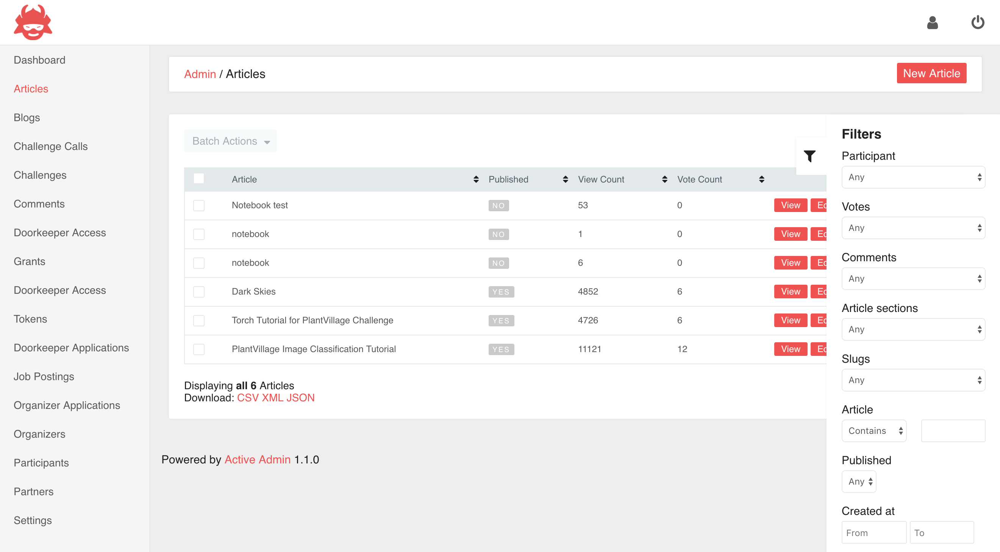

# crowdAI Admin
[](https://rubygems.org/gems/crowdai_admin)
[](https://rubygems.org/gems/crowdai_admin)
[](https://gemnasium.com/github.com/cle61/crowdai_admin)

### Credits

Simple theme for ActiveAdmin for [crowdAI](https://www.crowdai.org), developed by [Sean F. Carroll](https://github.com/seanfcarroll).

Inspiration and code was taken from the following projects

* [ArcticAdmin](https://github.com/cle61/crowdai_admin)
* [ActiveAdmin Addons](https://github.com/platanus/activeadmin_addons)
* [ActiveAdmin SimpleForm](https://github.com/blocknotes/activeadmin_simple_form)

### Features

#### General

* Updated styling based on [crowdAI](https://www.crowdai.org/) and easily themed


#### Gems

* [activeadmin_simple_form](https://github.com/blocknotes/activeadmin_simple_form)
* [activeadmin_select_many](https://github.com/blocknotes/activeadmin_select_many)





## Installation

- Add this to your Gemfile:

```ruby
gem 'crowdai_admin'
```

- Run `bundle install`.

- Add this line to the file `config/initializers/active_admin.rb`

```ruby
meta_tags_options = { viewport: 'width=device-width, initial-scale=1' }
config.meta_tags = meta_tags_options
config.meta_tags_for_logged_out_pages = meta_tags_options
```

## Usage

### CSS

Remove the `active_admin.css`, and instead add this to your `application.scss`

In your `active_admin.css`, include the css file:

```css
@import "crowdai_admin/base";
```

**Remove the line `*= require active_admin/base`**

Then restart your webserver if it was previously running.s

### JS

In your `active_admin.js`, include the js file:

```js
//= require crowdai_admin/base
```

**Remove the line `//= require active_admin/base`**


## Contributing

1. Fork it ( https://github.com/crowdAI/crowdai_admin/fork )
2. Create your feature branch (`git checkout -b my-new-feature`)
3. Commit your changes (`git commit -am 'Add some feature'`)
4. Push to the branch (`git push origin my-new-feature`)
5. Create new Pull Request
